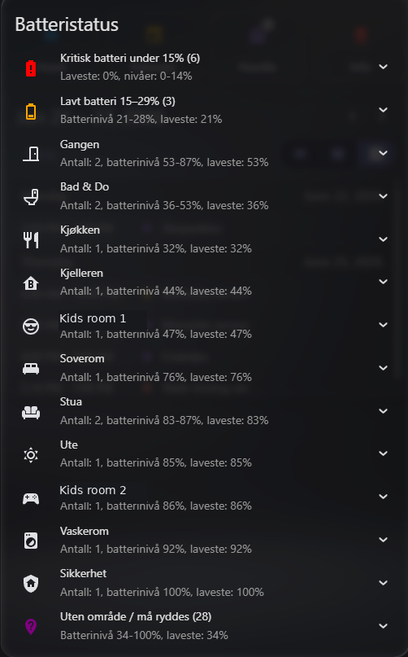

# Auto-grouped battery dashboard card

## Goal

A low-maintenance Home Assistant battery overview that automatically discovers battery entities, highlights batteries that need attention and groups the rest by Home Assistant Area.

The pattern avoids long manually maintained battery lists. When a new battery-powered device is added, it is automatically included. If the device has an Area, it appears under that Area. If not, it appears in a cleanup group.

## Design pattern

- **Auto-discovery:** includes entities with `device_class: battery`.
- **Attention first:** critical and low batteries are shown before normal batteries.
- **Area-based grouping:** healthy batteries are grouped dynamically with `by: "area.name"`.
- **Cleanup queue:** batteries without an Area are collected in a dedicated group.
- **No manual entity list:** new sensors are handled automatically when they expose the battery device class.
- **Operational thresholds:** under 15% is critical; 15–29% is low; 30% and above is grouped by Area.

## Requirements

- Home Assistant Lovelace dashboard
- [`custom:battery-state-card`](https://github.com/maxwroc/battery-state-card), normally installed through HACS
- Battery sensors exposing `device_class: battery`
- Devices assigned to Home Assistant Areas for best grouping results

## Screenshot



## Lovelace card

```yaml
type: custom:battery-state-card
title: Battery status
default_config_base: false

secondary_info: "{last_changed}"

sort:
  by: state
  desc: false

filter:
  include:
    - name: "attributes.device_class"
      value: battery
  exclude:
    - name: entity_id
      value: "binary_sensor.*"

colors:
  steps:
    - "#ff0000"
    - "#ffaa00"
    - "#00aa00"
  gradient: true

collapse:
  - name: "Critical battery under 15% ({count})"
    secondary_info: "Lowest: {min}%, levels: {range}%"
    icon: mdi:battery-alert
    icon_color: red
    filter:
      - name: computed.state
        operator: "<"
        value: 15

  - name: "Low battery 15–29% ({count})"
    secondary_info: "Battery levels {range}%, lowest: {min}%"
    icon: mdi:battery-low
    icon_color: orange
    filter:
      - name: computed.state
        operator: ">="
        value: 15
      - name: computed.state
        operator: "<"
        value: 30

  - by: "area.name"
    secondary_info: "Devices: {count}, battery levels {range}%, lowest: {min}%"
    icon: "{area.icon}"
    filter:
      - name: computed.state
        operator: ">="
        value: 30
      - name: "area.name"
        operator: exists

  - name: "No area / needs cleanup ({count})"
    secondary_info: "Battery levels {range}%, lowest: {min}%"
    icon: mdi:map-marker-question
    icon_color: purple
    filter:
      - name: computed.state
        operator: ">="
        value: 30
      - name: "area.name"
        operator: not_exists
```

## How it behaves

The card creates this kind of structure:

```text
Battery status
├── Critical battery under 15%
├── Low battery 15–29%
├── Bathroom
├── Hallway
├── Kitchen
├── Living room
├── Bedroom
└── No area / needs cleanup
```

New devices require no Lovelace YAML changes:

1. Add or pair the device in Home Assistant.
2. Make sure the battery entity has `device_class: battery`.
3. Assign the device to an Area.
4. The card automatically places it in the right group.

Devices without an Area intentionally stay visible in `No area / needs cleanup`, which turns the dashboard into a small maintenance checklist.

## Important implementation notes

When using dynamic grouping with `by: "area.name"`, do **not** set a custom `name:` field for that group. The battery-state-card uses the Area name automatically. If you add something like `name: "{area.name} ({count})"`, the card may render the literal text instead of the Area name.

Use `computed.state` for threshold filters. In newer battery-state-card versions, `state` is the original Home Assistant state, while `computed.state` reflects the value after card-side conversions such as `state_map`.

`default_config_base: false` is intentional here. It prevents the card's default configuration from adding extra grouping/collapse behavior on top of this explicit pattern.

If `icon: "{area.icon}"` does not work well in your setup, replace it with a static icon:

```yaml
icon: mdi:home-map-marker
```

## Tuning thresholds

Adjust the threshold values if your household prefers a different replacement window:

```yaml
# Critical
operator: "<"
value: 15

# Low
operator: ">="
value: 15
operator: "<"
value: 30
```

Common alternatives:

- Critical under 10%, low 10–24%
- Critical under 20%, low 20–39% for devices that report battery unreliably
- Show only low batteries by removing the Area grouping section

## Why this works well

- It is quiet when everything is healthy.
- It surfaces the devices that need attention first.
- It scales as the smart home grows.
- It uses Home Assistant's Area model instead of custom manual groups.
- It gives a clear cleanup path for unassigned devices.

## Privacy note

The example uses generic names, no private entity IDs and no household-specific room names. Screenshots should be anonymized before publication if they include real room names, people, cameras, alarms or security devices.
