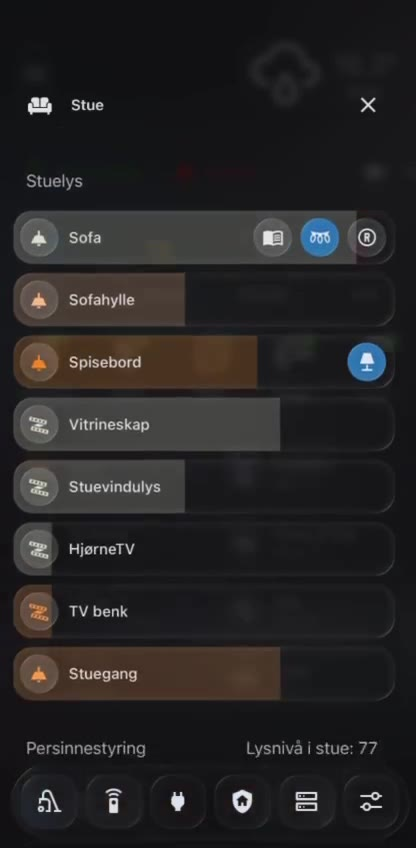

# Living-room dashboard: lights, blinds and IR heat pump

<video src="../assets/dashboards/living-room-dashboard-anonymized.mp4" controls muted playsinline poster="../assets/dashboards/living-room-dashboard-still.jpg" width="360">
  Your browser can also open the anonymized dashboard walkthrough directly from `assets/dashboards/living-room-dashboard-anonymized.mp4`.
</video>

Fallback still image:



## Goal

A room-level dashboard for daily living-room control. It keeps lighting, blinds and climate-adjacent controls in one mobile-friendly panel while preserving the same frosted-glass style as the main dashboard.

## Design pattern

- **Room drill-down:** opened from the mobile main dashboard's living-room tile.
- **Frosted glass cards:** dark translucent Bubble Card/Mushroom-style rows with icon-first controls.
- **At-a-glance metrics:** small top row for air/comfort signals such as CO₂/particles/humidity and current setpoint/status.
- **Grouped controls:** lighting first, then blinds, with bottom navigation still available.
- **Large horizontal rows:** each light group has a readable label, icon and state/brightness affordance for touch use.

## Visible controls

### Lighting

The living-room lighting section groups multiple zones instead of exposing only raw entities:

- sofa
- shelf/accent light
- dining table
- display cabinet
- window light
- TV corner
- TV bench
- hallway/room transition light

This makes the dashboard usable as a room scene controller while still allowing individual zone control.

### Blinds

The blinds section exposes simple directional controls:

- blinds up
- stop
- blinds down
- separate tilt controls where relevant

The dashboard also shows a living-room light level value, which is useful context for blind automation and manual overrides.

### Heat pump / Broadlink IR

The related living-room climate pattern uses a Broadlink IR remote and a Home Assistant helper as the source of intended state.

```yaml
script:
  living_room_heat_pump_up:
    sequence:
      - action: remote.send_command
        target:
          entity_id: remote.living_room_broadlink
        data:
          device: heat_pump
          command: temperature_up
      - action: input_number.increment
        target:
          entity_id: input_number.living_room_heat_pump_setpoint

  living_room_heat_pump_down:
    sequence:
      - action: remote.send_command
        target:
          entity_id: remote.living_room_broadlink
        data:
          device: heat_pump
          command: temperature_down
      - action: input_number.decrement
        target:
          entity_id: input_number.living_room_heat_pump_setpoint
```

The helper was calibrated from the physical remote before the remote was put away. This is a practical pattern for IR devices that do not report their real setpoint back to Home Assistant.

## Why this works well

- The main dashboard stays clean while the room dashboard carries detail.
- Light groups are named by how people use the room, not by technical entity names.
- Blinds, light level and lighting are colocated because they affect the same comfort/ambience decisions.
- The bottom navigation keeps global functions one tap away even inside a room view.
- IR climate control becomes understandable by pairing one-way Broadlink commands with an `input_number` setpoint helper.

## Privacy note

The public video is anonymized and muted:

- household presence/photos from the opening main-dashboard frames are covered
- private room labels from the opening frames are covered
- audio is removed
- exact entity IDs, household names and raw Lovelace YAML are not published
