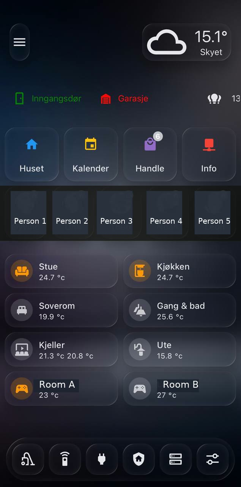

# Mobile-first main dashboard

## Goal

A mobile-first Home Assistant dashboard used as the shared daily control surface for the household. The design prioritizes quick status checks, room navigation and frequently used actions over dense raw entity lists.

## Design pattern

- **Mobile-first layout:** large touch targets and stacked rows that work well one-handed.
- **Frosted glass visual style:** dark background with translucent cards, soft shadows and blurred panels.
- **Mushroom + Bubble Card mix:** Mushroom-style entities for compact state display combined with Bubble Card navigation/action rows.
- **Top status strip:** weather, door/garage state and high-level home status are visible before scrolling.
- **Household presence row:** person cards show anonymized presence/home state. Public screenshot redacts faces and names.
- **Room cards:** each room card shows the most important temperature/status signal and acts as a drill-down entry point.
- **Bottom dock:** persistent shortcut bar for the most-used dashboard sections such as cleaning, remotes, power/energy, home/security, server/homelab and settings.

## Visible sections

- Weather card with current outdoor temperature and condition.
- Door/garage status indicators with color-coded state.
- Main navigation cards: house, calendar, shopping and info.
- Household presence/person row with status badges.
- Room tiles for living room, kitchen, bedroom, hallway/bath, basement, outside and two child/game rooms.
- Bottom navigation dock for common operational modes.

Related room drill-down: [Living-room dashboard](living-room-dashboard.md).

## Why this works well

- The dashboard is not just a control panel; it is a household status overview.
- Status is grouped by how people think: home, people, rooms and quick actions.
- Temperature is surfaced at the room level, which makes climate issues visible without opening each room.
- Room-specific controls are moved into drill-down pages so the main dashboard stays clean.

## Privacy note

The public screenshot is anonymized:

- personal faces are obscured
- person names are replaced with placeholders
- child/game-room names are replaced with generic room labels
- exact entity IDs and notification targets are omitted

The original private dashboard may contain household-specific names, photos and room labels that are not published here.
